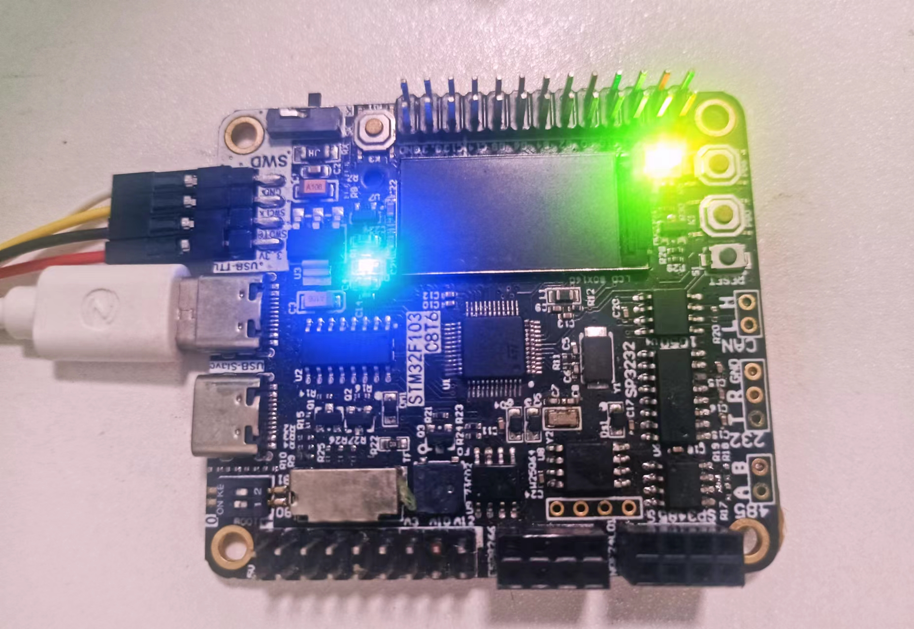
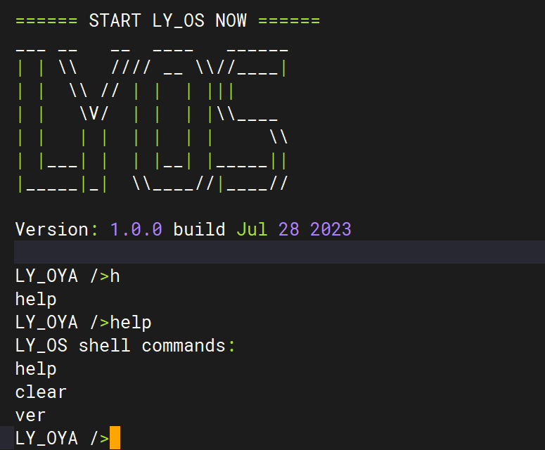

# LY_OS

## 1. 概述

LY_OS 操作系统是适用于高安全高可靠的商用场合，使用全静态化内存分配，具有较强的可拓展性和可移植性

## 2. 项目文件说明

* arch：不同开发板在不同开发环境下的工程，例如：keil
* board：不同芯片架构的启动文件，线程切换文件
* components：OS相关组件，例如：shell
* kernel：OS内核，包括线程处理，时钟处理，中断处理，信号量，邮箱
* lib：OS 相关库，例如：链表，环形缓冲区
* config.h: 内核配置文件

## 3.  运行 LY_OS

`基于STM32F103, 使用 USART1，打开 arch\stm32\stm32f103\keil下的工程，编译程序并下载，可到开发板红绿灯亮`

 

 

观察串口输出，波特率15200，可运行shell命令，串口输出如下图：

 

## 4. 内核功能

计划支持以下ipc功能：

+ [x] 邮箱
+ [x] 信号量
+ [ ] 消息队列
+ [ ] 互斥锁
+ [ ] 共享内存

## 5. 组件支持

计划支持以下组件：

+ [x] shell
+ [ ] dfs
+ [ ] tensorflow
+ [ ] lwp

##  6. 架构支持

初步计划支持以下架构：

+ [x] cortex-m3
+ [ ] cortex-m4
+ [ ] cortex-m7

